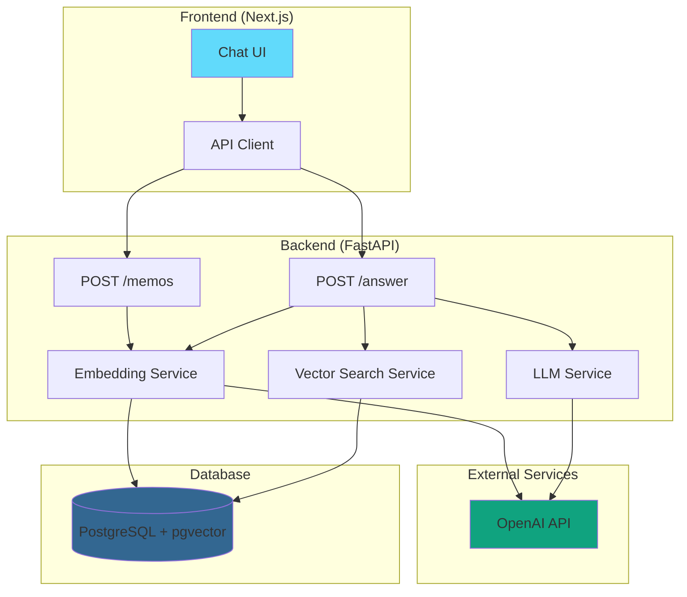

# Analysis of the Self - RAG就活支援アプリ

日本のIT業界への新卒就職を目指すユーザー向けの、RAG（Retrieval-Augmented Generation）を活用した自己分析・ES作成支援アプリケーションです。


## 🎯 主な機能

- **メモ保存**: 過去の経験や価値観をテキストで保存
- **自動Embedding生成**: OpenAI APIを使用してテキストをベクトル化
- **ベクトル検索**: pgvectorを使用した高速な類似度検索
- **AI回答生成**: GPT-4o-miniによる構造化された回答生成
- **チャットUI**: Reactベースの直感的なインターフェース

## 🏗️ アーキテクチャ



## 🛠️ 使用技術

### Frontend

- **Next.js 16.0.3** (App Router)
- **React 19.2.0**
- **TypeScript**
- **TailwindCSS**
- **react-markdown** - Markdown表示

### Backend

- **Python 3.11+**
- **FastAPI 0.121.3**
- **SQLAlchemy 2.0.44** - ORM
- **Alembic 1.13.1** - マイグレーション
- **OpenAI SDK 2.8.1**
- **pgvector 0.4.1** - ベクトル検索

### Infrastructure

- **Docker & Docker Compose**
- **PostgreSQL** with **pgvector**

## 📋 前提条件

- Docker Desktop
- OpenAI API Key

## 🚀 セットアップ方法

### 1. リポジトリのクローン

```bash
git clone https://github.com/arashi0-git/analysis_of_the_self.git
cd analysis_of_the_self
```

### 2. 環境変数の設定

`.env`ファイルをプロジェクトルートに作成:

```env
OPENAI_API_KEY=your_openai_api_key_here

POSTGRES_USER=user
POSTGRES_PASSWORD=password
POSTGRES_DB=analysis_db
DATABASE_URL=postgresql://user:password@db:5432/analysis_db
```

### 3. Dockerコンテナの起動

```bash
docker compose up -d --build
```

### 4. データベースマイグレーション

```bash
docker compose exec backend alembic upgrade head
```

## 💻 使用方法

### アプリケーションへのアクセス

ブラウザで以下のURLにアクセス:

```
http://localhost:3000/chat
```

### メモの保存

APIを使用してメモを保存:

```bash
curl -X POST http://localhost:8001/memos \
  -H "Content-Type: application/json" \
  -d '{"text": "私の強みは粘り強さと論理的思考力です。"}'
```

### チャットで質問

UIから質問を入力すると、保存されたメモを検索してAIが回答を生成します。

## 📁 プロジェクト構造

```
analysis_of_the_self/
├── frontend/               # Next.js フロントエンド
│   ├── src/
│   │   ├── app/           # App Router ページ
│   │   ├── components/    # Reactコンポーネント
│   │   └── lib/           # ユーティリティ
│   └── Dockerfile
├── backend/               # FastAPI バックエンド
│   ├── app/
│   │   ├── main.py       # エントリーポイント
│   │   ├── models.py     # SQLAlchemyモデル
│   │   ├── schemas.py    # Pydanticスキーマ
│   │   └── services/     # ビジネスロジック
│   ├── alembic/          # マイグレーション
│   └── Dockerfile
├── scripts/              # ユーティリティスクリプト
└── docker-compose.yml
```

## 🔧 開発

### バックエンドのテスト

```bash
docker compose exec backend pytest
```

### コードフォーマット

```bash
# Backend
docker compose exec backend ruff format .

# Frontend
docker compose exec frontend npm run format
```

## 📝 API エンドポイント

### POST /memos

メモを保存し、自動的にEmbeddingを生成

**Request:**

```json
{
  "text": "メモの内容"
}
```

**Response:**

```json
{
  "status": "success",
  "message": "Memo saved successfully"
}
```

### POST /answer

質問に対してRAGベースの回答を生成

**Request:**

```json
{
  "query_text": "私の強みは何ですか？"
}
```

**Response:**

```json
{
  "reasoning": "思考プロセス",
  "answer_text": "回答テキスト",
  "referenced_memo_ids": ["uuid1", "uuid2"]
}
```

## 🎨 主な実装ポイント

### 構造化出力

OpenAIの`beta.chat.completions.parse`を使用し、Pydanticモデルで型安全な回答を生成

### ベクトル検索

pgvectorのコサイン距離を使用した高速な類似度検索

### 競合状態制御

フロントエンドで複数リクエストの順序制御を実装

### タイムアウト処理

APIリクエストに30秒のタイムアウトを設定

## 📄 ライセンス

MIT License

## 👤 作成者

arashi0-git
