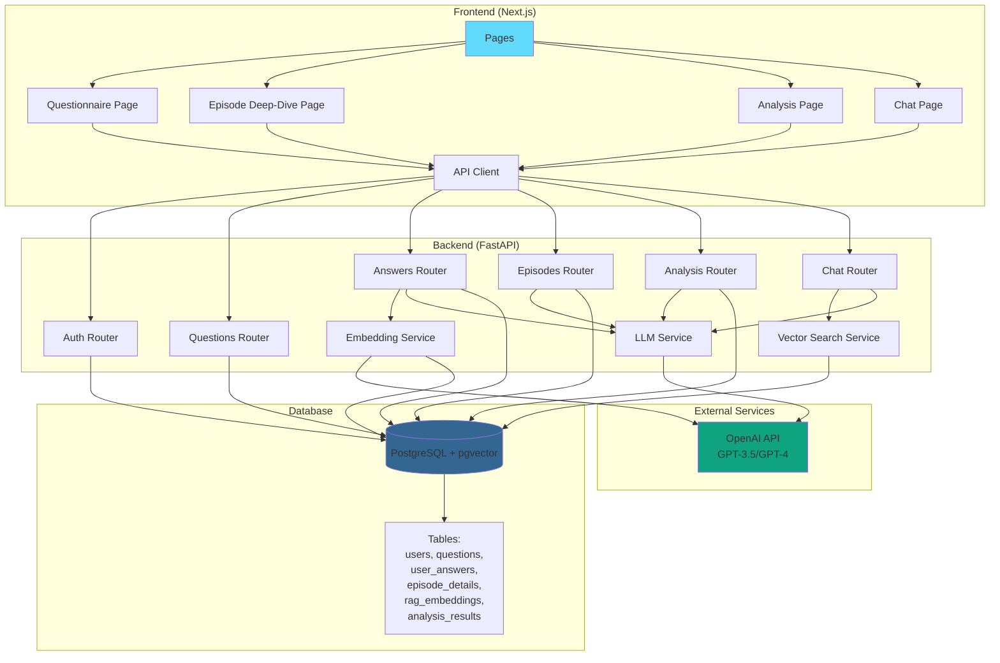

# Analysis of the Self - AI自己分析支援アプリ

RAG（Retrieval-Augmented Generation）とAIを活用した、自己分析・就活支援アプリケーションです。

## 📸 スクリーンショット

### ホームページ


### 質問回答ページ（AI添削機能付き）


### 分析結果ページ


### チャットページ


## 🎯 主な機能

### 1. ユーザー認証

- JWT認証による安全なログイン・登録
- Argon2によるパスワードハッシュ化
- セッション管理

### 2. 質問回答システム（7問構成）

- **質問1-3**: 小・中・高校時代の印象的な出来事
  - AI添削機能（GPT-3.5-turbo）による改善提案
  - 具体性の向上、深掘り質問、強みの明確化
- **質問4-7**: 学生時代の取り組み、価値観、将来像
  - **エピソード深堀機能**（STAR法/5W1H）
  - AI自動まとめ生成
  - AI添削によるフィードバック
- 個別保存機能（一問ずつ保存可能）
- 既存回答の編集

### 3. エピソード深堀機能

- **STAR法**: Situation（状況）、Task（課題）、Action（行動）、Result（結果）
- **5W1H法**: What（何を）、Why（なぜ）、When（いつ）、Where（どこで）、Who（誰と）、How（どのように）
- AI自動まとめ生成
- 就活支援専門家視点でのAI添削
- RAG統合による回答の活用

### 4. AI分析

- OpenAI GPT-4を使用した自己分析
- キーワード抽出
- 強みの特定（エビデンス付き）
- 価値観の分析
- 総合サマリー生成

### 5. RAGチャット

- pgvectorによるベクトル検索
- 過去の回答・エピソード詳細を参照したAI回答生成
- リアルタイムチャットUI
- コンテキストを考慮した自然な対話

### 6. 統合UX

- 質問回答と編集を1ページで完結
- レスポンシブデザイン
- 直感的なUI/UX
- タイムアウト処理とエラーハンドリング

## 🏗️ アーキテクチャ



## 🛠️ 使用技術

### Frontend

- **Next.js 15.1.3** (App Router)
- **React 19.0.0**
- **TypeScript**
- **TailwindCSS**
- **react-markdown** - Markdown表示

### Backend

- **Python 3.11+**
- **FastAPI 0.121.3**
- **SQLAlchemy 2.0.44** - ORM
- **Alembic 1.13.1** - マイグレーション
- **OpenAI SDK 1.59.5**
- **pgvector 0.4.1** - ベクトル検索
- **Argon2** - パスワードハッシュ化
- **PyJWT** - JWT認証

### Infrastructure

- **Docker & Docker Compose**
- **PostgreSQL 15** with **pgvector**

### 開発ツール

- **Ruff** - Python linter/formatter
- **Prettier** - フロントエンドフォーマッター
- **pre-commit** - コミット前チェック

## 📋 前提条件

- Docker Desktop
- OpenAI API Key

## 🚀 セットアップ方法

### 1. リポジトリのクローン

```bash
git clone https://github.com/arashi0-git/analysis_of_the_self.git
cd analysis_of_the_self
```

### 2. 環境変数の設定

`.env`ファイルをプロジェクトルートに作成:

```env
OPENAI_API_KEY=your_openai_api_key_here

POSTGRES_USER=user
POSTGRES_PASSWORD=password
POSTGRES_DB=analysis_db
DATABASE_URL=postgresql://user:password@db:5432/analysis_db

# JWT設定
SECRET_KEY=your_secret_key_here
ALGORITHM=HS256
ACCESS_TOKEN_EXPIRE_MINUTES=30
```

### 3. Dockerコンテナの起動

```bash
docker compose up -d --build
```

### 4. データベースマイグレーション

```bash
docker compose exec backend alembic upgrade head
```

### 5. 質問データの投入

```bash
docker compose exec backend python -m app.scripts.seed_questions
```

## 💻 使用方法

### アプリケーションへのアクセス

ブラウザで以下のURLにアクセス:

```
http://localhost:3000
```

### 基本的な使用フロー

1. **ユーザー登録/ログイン**
   - トップページから新規登録またはログイン

2. **質問回答**
   - 7つの質問に回答
   - 質問1-3: AI添削機能で改善提案を受ける
   - 質問4-7: エピソード深堀ページで詳細を記録

3. **エピソード深堀**（質問4-7）
   - STAR法または5W1H法で詳細を整理
   - AI自動まとめ生成
   - AI添削でフィードバックを受ける

4. **分析結果の確認**
   - AIによる自己分析結果を確認
   - キーワード、強み、価値観、サマリーを取得

5. **AIチャット**
   - 過去の回答を参照したAI対話
   - 自己分析の深掘りや質問

## 📁 プロジェクト構造

```
analysis_of_the_self/
├── frontend/                  # Next.js フロントエンド
│   ├── src/
│   │   ├── app/              # App Router ページ
│   │   │   ├── page.tsx      # ホーム
│   │   │   ├── login/        # ログイン
│   │   │   ├── register/     # 登録
│   │   │   ├── questionnaire/ # 質問回答
│   │   │   ├── episode/      # エピソード深堀
│   │   │   ├── analysis/     # 分析結果
│   │   │   └── chat/         # AIチャット
│   │   ├── components/       # Reactコンポーネント
│   │   ├── lib/              # ユーティリティ
│   │   └── contexts/         # React Context
│   └── Dockerfile
├── backend/                   # FastAPI バックエンド
│   ├── app/
│   │   ├── main.py           # エントリーポイント
│   │   ├── models.py         # SQLAlchemyモデル
│   │   ├── schemas.py        # Pydanticスキーマ
│   │   ├── routers/          # APIルーター
│   │   │   ├── auth.py       # 認証
│   │   │   ├── questionnaire.py # 質問・回答
│   │   │   ├── episodes.py   # エピソード深堀
│   │   │   ├── analysis.py   # AI分析
│   │   │   └── chat.py       # RAGチャット
│   │   ├── services/         # ビジネスロジック
│   │   └── scripts/          # ユーティリティスクリプト
│   ├── alembic/              # マイグレーション
│   └── Dockerfile
├── scripts/                   # ユーティリティスクリプト
└── docker-compose.yml
```

## 🔧 開発

### バックエンドのlintチェック

```bash
docker compose exec backend ruff check .
```

### バックエンドのフォーマット

```bash
docker compose exec backend ruff format .
```

### フロントエンドのlintチェック

```bash
docker compose exec frontend npm run lint
```

### フロントエンドのフォーマット

```bash
docker compose exec frontend npm run format
```

### pre-commitフックの実行

```bash
pre-commit run --all-files
```

## 📝 主要APIエンドポイント

### 認証

- `POST /auth/register` - ユーザー登録
- `POST /auth/login` - ログイン
- `GET /auth/me` - 現在のユーザー情報取得

### 質問・回答

- `GET /questions` - 質問一覧取得
- `GET /answers` - ユーザーの回答一覧取得
- `POST /answers` - 回答の保存
- `POST /answers/{question_id}/feedback` - AI添削取得

### エピソード深堀

- `POST /episodes/{question_id}` - エピソード詳細の作成/更新
- `GET /episodes/{question_id}` - エピソード詳細の取得
- `POST /episodes/{question_id}/feedback` - AI添削取得
- `POST /episodes/{question_id}/summary` - まとめ自動生成

### 分析

- `POST /analysis` - AI分析実行
- `GET /analysis/latest` - 最新の分析結果取得

### チャット

- `POST /chat/answer` - RAGベースの回答生成

## 🎨 主な実装ポイント

### 構造化出力

OpenAIの`chat.completions.create`を使用し、Pydanticモデルで型安全な回答を生成

### ベクトル検索

pgvectorのコサイン距離を使用した高速な類似度検索。重み付け機能により重要な情報を優先的に検索

### タイムアウト処理

- CRUD操作: 30秒
- AI処理: 60秒
- AbortControllerによる適切なクリーンアップ

### エラーハンドリング

- APIレスポンスの詳細なエラーメッセージ
- ユーザーフレンドリーなエラー表示
- ログによるデバッグ支援

### 入力検証

- フロントエンド: React Hooksによるリアルタイム検証
- バックエンド: Pydanticスキーマによる型検証
- データベース: UniqueConstraintによる整合性保証

## 🗄️ データベーススキーマ

主要なテーブル:

- `users` - ユーザー情報
- `questions` - 質問マスタ（7問）
- `user_answers` - ユーザーの回答
- `episode_details` - エピソード深堀データ（STAR/5W1H）
- `rag_embeddings` - ベクトル埋め込み
- `analysis_results` - AI分析結果
- `chat_logs` - チャット履歴

## 📄 ライセンス

MIT License

## 👤 作成者

arashi0-git

## 🙏 謝辞

このプロジェクトは以下の技術を使用しています:

- [OpenAI](https://openai.com/) - GPT-3.5/GPT-4 API
- [pgvector](https://github.com/pgvector/pgvector) - PostgreSQL向けベクトル検索拡張
- [FastAPI](https://fastapi.tiangolo.com/) - 高速なPython Webフレームワーク
- [Next.js](https://nextjs.org/) - React フレームワーク
